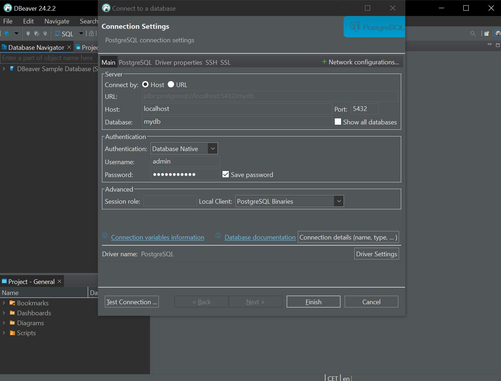
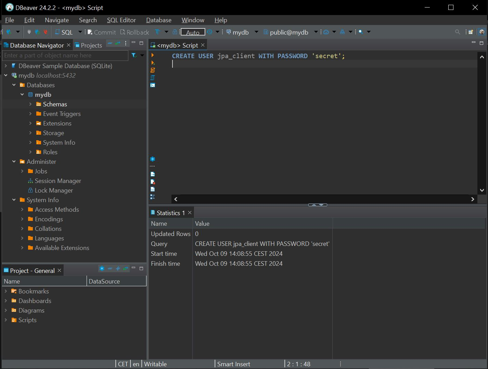

# Assignment 4

## Explanation
* I followed the tutorial and applied the commands. Here are some screenshots along the way.

## Experiment 1

* First I put the commands in a terminal. I tried both in wsl and in powershell. 

* I used DBeaver to test the connection.

* I also created the user in DBeaver.

* I did not finish experiment 1 completely. I did not manage to get the tests to pass. 

## Experiment 2

* I set up the dockerfile and was able to make the container. I first ran the command ./gradlew build, and i then ran the docker build command like this:

* The dockerfile looks like this:

Here is the [docker file](https://github.com/AudunKristian/demo/blob/main/Dockerfile) in the context of Expass 3.   

## Challenges
* I had trouble running the Docker program in the beginning. The way I solved this was by making sure that my Pc had enough storage space, which was the problem why some of the commands did not respond in the beginning.
* I had also trouble compiling the program with the correct Java-version. I solved this by changing terminal to run in WSL, and then make sure that Java and Gradle was installed correctly and set up correctly in build.gradle.kts.
* I took some tries to make the docker build file run as intended, managed it with chatGPT.

## To do 
* Finish the connection in experiment experiment 1.