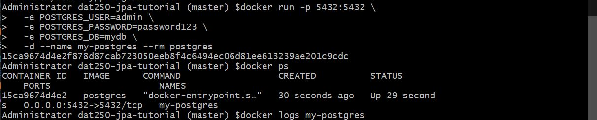
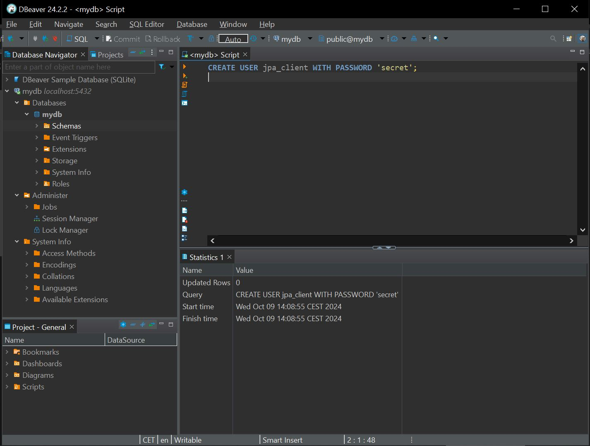
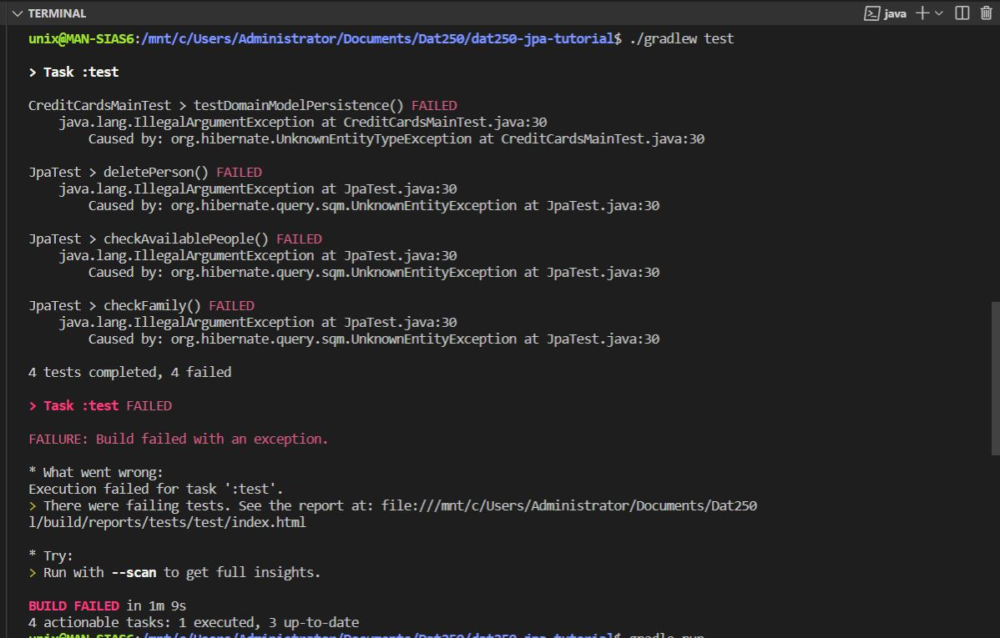

# Assignment 4

## Explanation
* I followed the tutorial and applied the commands. Here are some screenshots along the way.

* First I put the commands in a terminal. I tried both in wsl and in powershell. 

* I used DBeaver to test the connection.

* I also created the user in DBeaver.

* I did not finish experiment 1 completely. I did not manage to get the tests to pass. I did not start on experiment 2, because I did not finish expass2 and expass7, which would make this one hard to solve from where I am at.

## Challenges
* I had trouble running the Docker program in the beginning. The way I solved this was by making sure that my Pc had enough storage space, which was the problem why some of the commands did not respond in the beginning.
* I had also trouble compiling the program with the correct Java-version. I solved this by changing terminal to run in WSL, and then make sure that Java and Gradle was installed correctly and set up correctly in build.gradle.kts.

## To do 
* Finish the connection in experiment 7.1 and start experiment 7.2. 